<h1 align="center">Job Search Dossier</h1>

<p align="center">
  A job-search assistant that ranks roles for a candidate, drafts cover letters,
  and rehearses answers — as a <strong>web app</strong>, a <strong>REST API</strong>, and a connectable <strong>MCP server</strong>.<br/>
  Runs with <strong>zero API keys</strong> by default; pulls real jobs from five public sources when you want them.
</p>

<p align="center">
  <a href="https://job-search-mcp-tau.vercel.app">
    
  </a>
  <a href="https://github.com/VikramKavuri/Jobsearch_using_MCP_server/actions/workflows/ci.yml">
    
  </a>
  
  
  
</p>

> **▶ Try it now:** **https://job-search-mcp-tau.vercel.app**
> No sign-up, no keys. Fill a profile, search jobs, generate a cover letter, rehearse a Q&A.

---

## Where it finds jobs

Tick **"Include live listings"** and it fetches from **five keyless sources in parallel**, filtered by your profile's role and location, then merges, de-duplicates, ranks, and **verifies every link is reachable before showing it**.

<p align="center">
  
</p>

| Source | Coverage | Filters used |
|---|---|---|
| **Remotive** | Remote roles | keyword search |
| **The Muse** | Remote **and on-site** | location |
| **Arbeitnow** | EU + remote | ranking |
| **RemoteOK** | Remote roles | role tag |
| **Jobicy** | Remote roles | region + role tag |

Without live listings, search runs instantly over a bundled, illustrative sample dataset.

## Your profile

Everything is keyed off a simple candidate profile. It's saved **only in your browser** (`localStorage`) and passed inline to each call — the server stays stateless.

<p align="center">
  
</p>

| Field | Used for |
|---|---|
| **Full name** | cover letters, Q&A voice |
| **Desired / current title** | job ranking + role filter |
| **Professional summary** | ranking, letters, Q&A |
| **Skills** | ranking, `fit_score`, match reasons |
| **Years of experience** | letters, Q&A |
| **Location** | location filter across sources |
| **Education** | Q&A answers |
| **Email** *(optional)* | validated if provided |

## The four capabilities — demo vs. live

| Capability | Zero-key demo | With an API key |
|---|---|---|
| **Profile** | Validate + normalize your profile | same |
| **Job search** | Rank by **TF-IDF cosine** → `fit_score` (0–100) + `match_reasons` | + live multi-source listings |
| **Cover letter** | Fill a tone-aware **template** (professional / casual / enthusiastic / formal) | **LLM-written** letter |
| **Q&A** | Heuristic answer from your profile | **LLM-written** answer |

The live deployment runs in **Live AI mode** via [Groq](https://console.groq.com) (`llama-3.3-70b-versatile`), so letters and answers are model-generated. The banner in the UI shows **Demo** vs **Live AI** at a glance.

## Use it as an MCP server

This app **is** a remote MCP server — connect any MCP client (Claude Desktop, Claude Code, Cursor, …) and let the model fetch jobs for a candidate.

- **Endpoint:** `https://job-search-mcp-tau.vercel.app/api/mcp` (Streamable HTTP + SSE)
- **Tools:** `profile_upsert`, `jobs_search`, `letter_generate`, `qa_reply`

```json
{
  "mcpServers": {
    "job-search": { "url": "https://job-search-mcp-tau.vercel.app/api/mcp" }
  }
}
```

> *"Find remote data-engineering roles for someone strong in Python, Spark and SQL"*
> → the model calls `jobs_search` and returns ranked, link-checked jobs with fit scores.

## REST API

| Method & path | Body | Returns |
|---|---|---|
| `GET /api/config` | — | `{ mode, provider, model, liveAiEnabled }` |
| `POST /api/profile` | profile fields | `{ profile }` (normalized) |
| `POST /api/jobs` | `{ query, profile, limit?, remoteOnly?, location?, live? }` | `{ jobs, count, sources, validated }` |
| `POST /api/letter` | `{ profile, job:{title,company}, tone? }` | `{ text, tone, mode }` |
| `POST /api/qa` | `{ question, profile, context? }` | `{ answer, mode }` |

```bash
curl -s -X POST https://job-search-mcp-tau.vercel.app/api/jobs \
  -H "Content-Type: application/json" \
  -d '{"query":"python data engineer","profile":{"skills":["python","spark","sql"]},"live":true,"limit":5}'
```

## Run locally

```bash
npm install
npm run dev      # http://localhost:3000
npm test         # 68 unit tests (pure functions, no network)
```

No `.env` needed — it starts in demo mode. To enable live AI, copy `.env.example`
to `.env.local` and set one key (`GROQ_API_KEY`, `ANTHROPIC_API_KEY`,
`OPENAI_API_KEY`, or `HF_TOKEN`).

## Deploy to Vercel

```bash
npm i -g vercel
vercel --prod    # prompts for login the first time
```

Vercel auto-detects Next.js. Add an API key under **Project → Settings → Environment
Variables** to enable live AI, then redeploy.

## How it's built

```
app/
  page.tsx                       Web UI: 4 tabs (Profile, Job Search, Cover Letter, Q&A)
  api/{config,profile,jobs,letter,qa}/route.ts   thin REST adapters
  api/[transport]/route.ts       MCP endpoint (4 tools) at /api/mcp
lib/
  tools/{profile,search,letter,qa}.ts   pure capability functions (+ unit tests)
  ranking.ts                     TF-IDF cosine over job text (pure TS)
  jobs-source.ts                 5 live sources + bundled sample, mappers, dedupe
  link-check.ts                  reachability validation for live job links
  config.ts                      env → real-vs-demo decision (the only env reader)
  llm.ts                         provider abstraction (Groq / OpenAI / Anthropic / HF ↔ demo)
  service.ts                     composition root shared by REST + MCP
```

The capability functions in `lib/tools/*` and `lib/ranking.ts` are **pure** — no Next,
no env, no network — and unit-tested in isolation. `lib/config.ts` is the only place
that reads env and decides demo-vs-live; tools receive an injected `llm` and never
branch on environment. REST and MCP both call `lib/service.ts`, so the two faces can
never drift.

> **Deeper dive:** [`docs/ARCHITECTURE.md`](docs/ARCHITECTURE.md) covers the data flow,
> the design trade-offs, and an honest "what would change to run this at scale".

## Engineering highlights

- **One core, three surfaces.** Web UI, REST, and MCP are thin adapters over a single
  composition root (`lib/service.ts`) — zero duplicated logic, so the surfaces can't drift.
- **Testable by construction.** The ranking and the four capabilities are pure functions;
  **68 deterministic unit tests** run offline (Vitest), exercised in CI on every push.
- **Resilient by design.** Five live sources are fetched in parallel and each degrades to
  `[]` on failure; results are de-duped, ranked, and **every link is reachability-checked**
  before it reaches the board — a single dead source or dead link never breaks search.
- **Pluggable AI.** A provider abstraction (`lib/llm.ts`) swaps Groq / OpenAI / Anthropic /
  HF behind one interface, with a deterministic demo path so nothing requires a key.
- **Honest about scale.** The architecture doc names the limitations (in-memory TF-IDF,
  per-request fetching) and the concrete path to production (caching, embeddings,
  persistence, observability) — each a localized change thanks to the boundaries above.

## Notes

- **Attribution:** live job data comes from Remotive, The Muse, Arbeitnow, RemoteOK and Jobicy. RemoteOK and The Muse ask that you credit them when displaying results.
- Stateless by design — no database; your profile lives in the browser.
- A clean Vercel rebuild of the original Hugging Face Spaces "Job Search MCP" concept (no torch / faiss / Gradio).

## License

[MIT](LICENSE) © VikramKavuri
